# SharpGraph Architecture

A comprehensive guide to the internal architecture of SharpGraph, a GraphQL-native embedded database engine for .NET.

## Table of Contents

1. [High-Level Architecture](#high-level-architecture)
2. [Component Overview](#component-overview)
3. [Layer Details](#layer-details)
   - [Server Layer](#server-layer)
   - [GraphQL Layer](#graphql-layer)
   - [Schema Layer](#schema-layer)
   - [Storage Layer](#storage-layer)
   - [Indexing Layer](#indexing-layer)
4. [Data Flow](#data-flow)
5. [Key Algorithms](#key-algorithms)
6. [Performance Optimizations](#performance-optimizations)

---

## High-Level Architecture

SharpGraph is built as a layered architecture where each layer has clear responsibilities and dependencies flow downward.

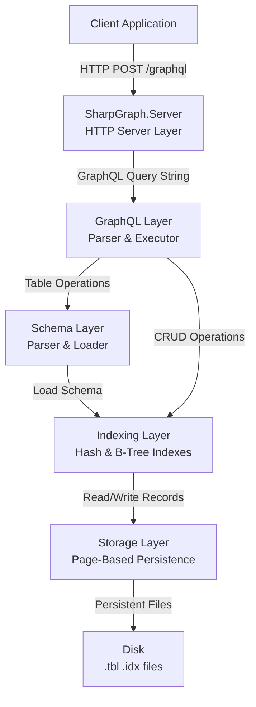

### Architecture Principles

1. **GraphQL-Native**: Schema and queries use GraphQL SDL - no C# class definitions needed
2. **Layered Design**: Clear separation of concerns with unidirectional dependencies
3. **Embedded Database**: No separate server process required (though HTTP server is optional)
4. **Performance-First**: Hash indexes (O(1)), B-tree indexes (O(log n)), and LRU page caching
5. **Persistence**: All data stored in memory-mapped files with crash recovery

---

## Component Overview

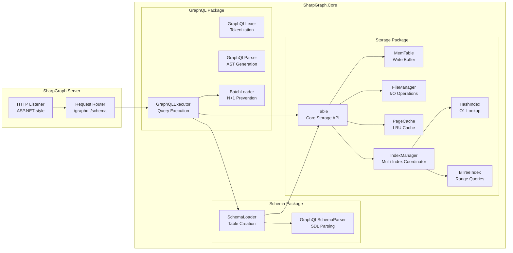

---

## Layer Details

### Server Layer

**Purpose**: Provides HTTP interface for remote access to the database.

**Components**:
- `Program.cs` - HTTP server initialization and request handling
- Request routing for `/graphql`, `/schema/*` endpoints
- JSON request/response serialization

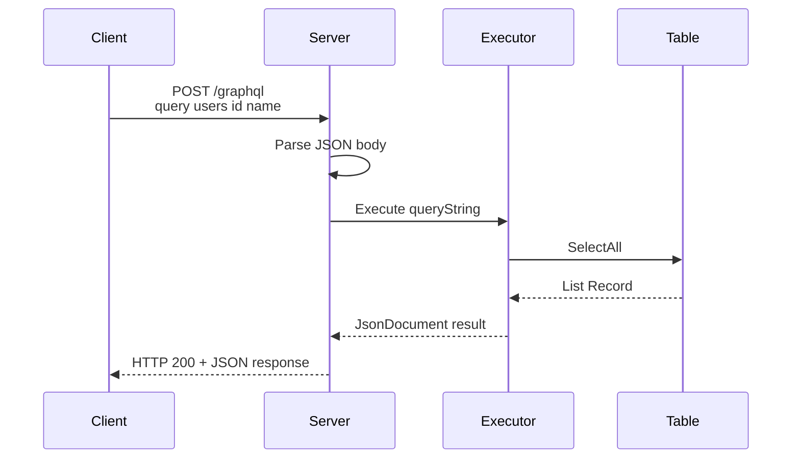

**Key Files**:
- `src/SharpGraph.Server/Program.cs` - Main server implementation (492 lines)

**Features**:
- GraphQL query endpoint (POST/GET)
- Schema management endpoints
- Data loading from JSON files
- Introspection support

---

### GraphQL Layer

**Purpose**: Parses GraphQL query syntax and executes queries against storage tables.

#### GraphQL Lexer

Tokenizes GraphQL query strings into tokens for parsing.

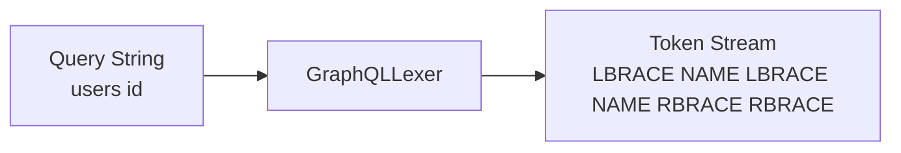

**Token Types**:
- `NAME` - identifiers (field names, type names)
- `LBRACE` / `RBRACE` - `{` / `}`
- `LPAREN` / `RPAREN` - `(` / `)`
- `COLON`, `COMMA`, `EQUALS`
- `STRING`, `INT`, `FLOAT`, `BOOLEAN`
- `SPREAD` - `...` for fragments

#### GraphQL Parser

Builds an Abstract Syntax Tree (AST) from tokens.

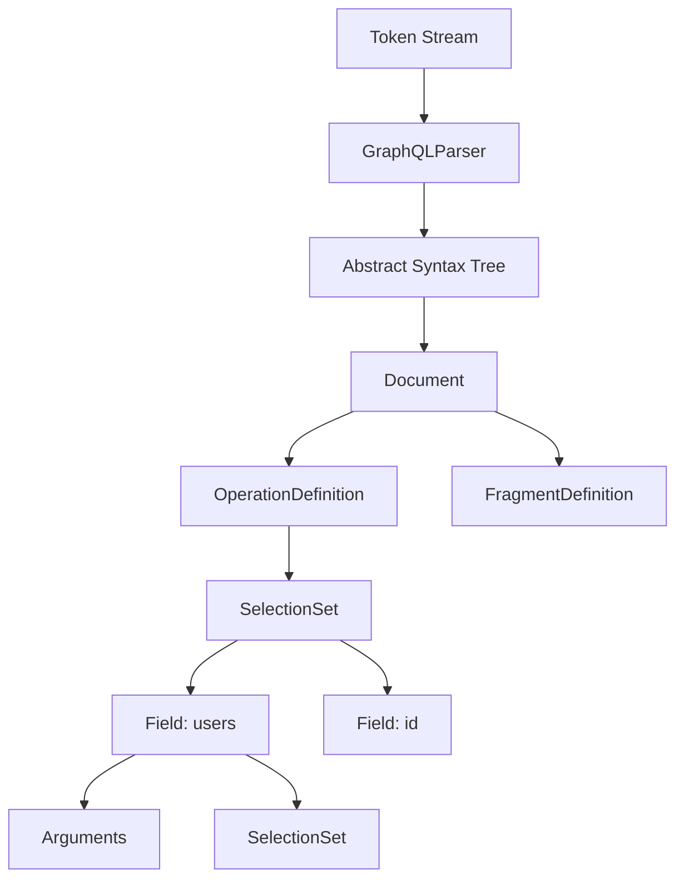

**AST Node Types**:
```csharp
// Core AST nodes
Document
├── OperationDefinition (Query, Mutation)
│   ├── SelectionSet
│   │   ├── Field
│   │   │   ├── Arguments
│   │   │   └── SelectionSet (nested)
│   │   └── FragmentSpread
│   └── VariableDefinitions
└── FragmentDefinition
    └── SelectionSet
```

#### GraphQL Executor

Executes AST against registered tables and resolves relationships.

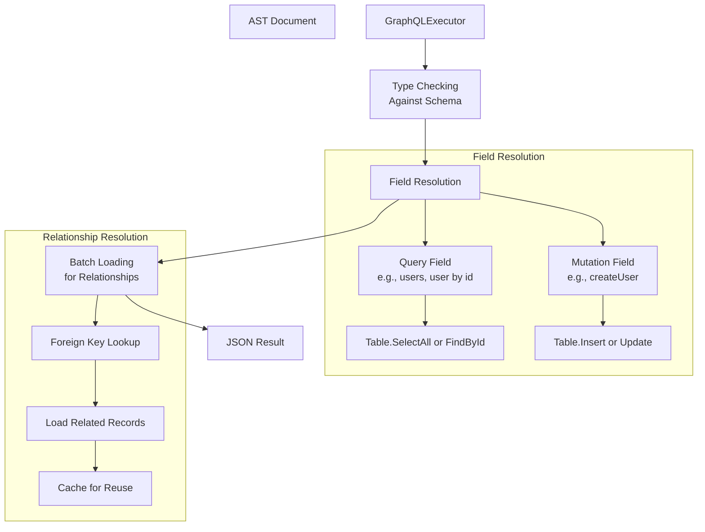

**Key Components**:
- **Type Resolution**: Maps GraphQL types to table schemas
- **Field Resolution**: Executes field queries against tables
- **Argument Handling**: Filters, pagination, ID lookups
- **Batch Loading**: Prevents N+1 queries for relationships

**Key Files**:
- `GraphQLLexer.cs` - Tokenization (412 lines)
- `GraphQLParser.cs` - AST construction (1,108 lines)
- `GraphQLExecutor.cs` - Query execution (1,224 lines)
- `BatchLoader.cs` - Relationship optimization (143 lines)
- `AST.cs` - AST node definitions (224 lines)

---

### Schema Layer

**Purpose**: Parses GraphQL SDL schema files and automatically creates database tables with proper types and relationships.

#### Schema Parser

Extracts type definitions, fields, enums, and relationships from `.graphql` files.

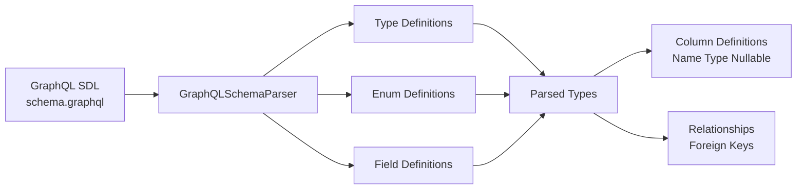

**Parsing Process**:
1. Remove comments from SDL
2. Match `type` definitions with regex
3. Extract fields with types (String, Int, ID, etc.)
4. Identify relationships (field types referencing other types)
5. Parse nullable (`!`) and list (`[]`) modifiers

**Example**:
```graphql
type User {
    id: ID!           # String, non-null, primary key
    name: String!     # String, non-null
    email: String!    # String, non-null
    posts: [Post]     # Relationship: User has many Posts
}
```

Parsed as:
```csharp
ParsedType {
    Name = "User",
    Fields = [
        ParsedField { Name = "id", Type = "ID", IsNonNull = true },
        ParsedField { Name = "name", Type = "String", IsNonNull = true },
        ParsedField { Name = "email", Type = "String", IsNonNull = true },
        ParsedField { Name = "posts", Type = "Post", IsList = true }
    ]
}
```

#### Schema Loader

Creates tables with proper metadata and relationships.

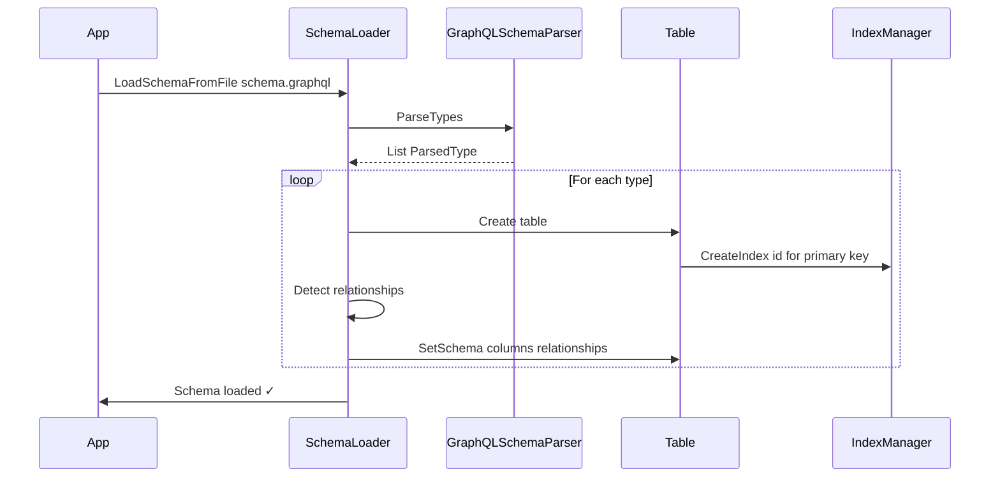

**Key Features**:
- **Automatic Table Creation**: No C# class definitions needed
- **Type Mapping**: GraphQL types → C# types → Storage types
- **Relationship Detection**: Identifies foreign keys from field types
- **Index Creation**: Auto-creates indexes on ID fields
- **Metadata Storage**: Stores schema in table metadata for persistence

**Type Mapping**:
```
GraphQL Type  →  C# Type      →  Storage Format
─────────────────────────────────────────────────
ID            →  string       →  UTF-8 string
String        →  string       →  UTF-8 string
Int           →  int          →  4-byte int
Float         →  double       →  8-byte double
Boolean       →  bool         →  1-byte bool
[Type]        →  List<T>      →  MessagePack array
CustomType    →  string (FK)  →  Foreign key reference
```

**Key Files**:
- `GraphQLSchemaParser.cs` - SDL parsing (250 lines)
- `SchemaLoader.cs` - Table generation (366 lines)

---

### Storage Layer

**Purpose**: Manages persistent page-based storage with write buffering and crash recovery.

#### Table

Core storage API that coordinates all storage operations.

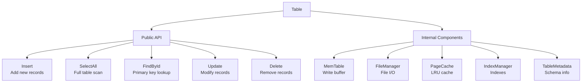

**Table Structure**:
```
Table File (.tbl)
├── Page 0: Metadata Page
│   ├── Table name
│   ├── Record count
│   ├── Page count
│   ├── Column definitions (schema)
│   └── Relationship definitions
├── Page 1-N: Data Pages (4KB each)
│   ├── Record 1 (MessagePack serialized)
│   ├── Record 2
│   └── ...
```

**Key Operations Flow**:

**INSERT**:
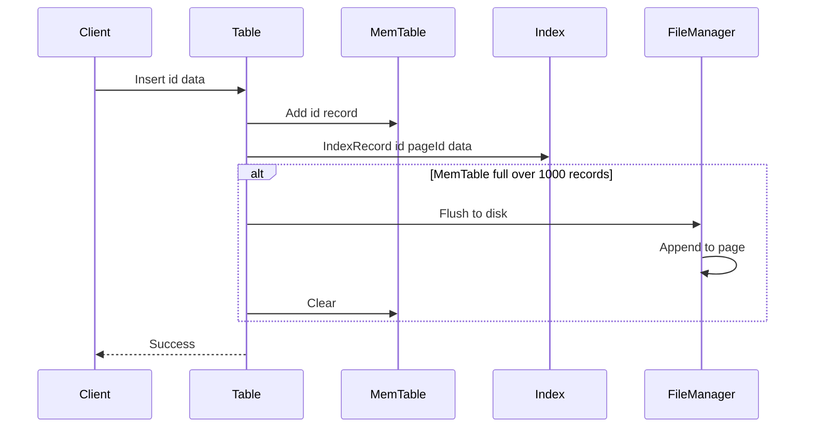

**QUERY (by ID)**:
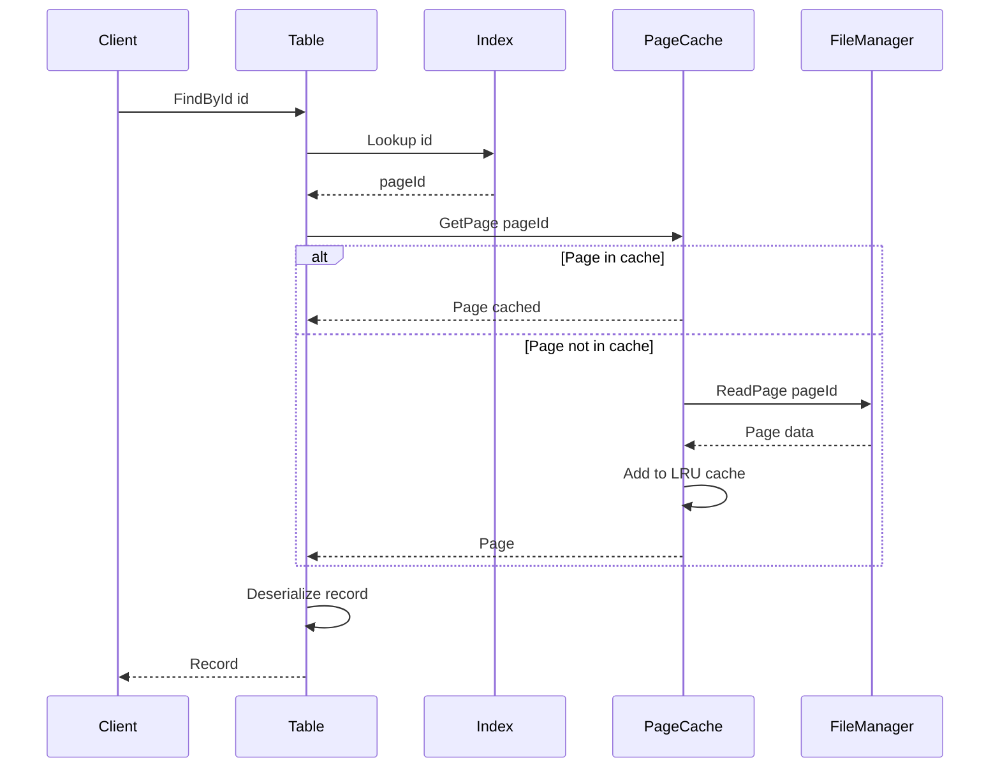

**Key Files**:
- `Table.cs` - Main storage API (711 lines)
- `Record.cs` - Record representation
- `SchemaBasedRecord.cs` - Schema-aware records
- `TableMetadata.cs` - Schema metadata

#### MemTable

In-memory write buffer that batches writes before flushing to disk.

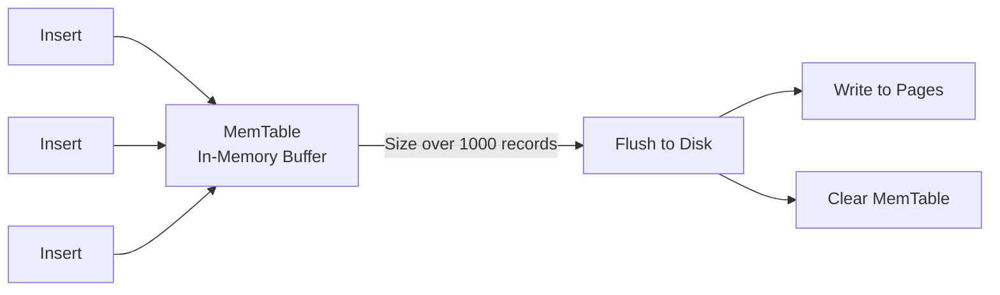

**Benefits**:
- Reduces disk I/O by batching writes
- Faster insert performance
- Maintains insertion order
- Automatic flush on threshold

#### PageCache

LRU cache for frequently accessed data pages.

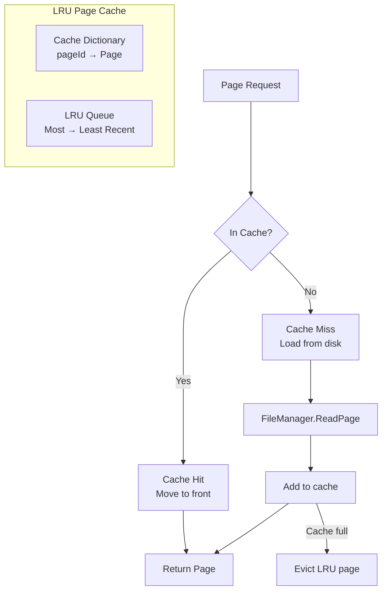

**Configuration**:
- Default capacity: 100 pages (~400KB)
- Page size: 4KB
- LRU eviction policy

**Key Files**:
- `MemTable.cs` - Write buffer (109 lines)
- `PageCache.cs` - LRU cache (78 lines)
- `Page.cs` - Page abstraction (33 lines)

#### FileManager

Low-level file I/O with page-based operations.

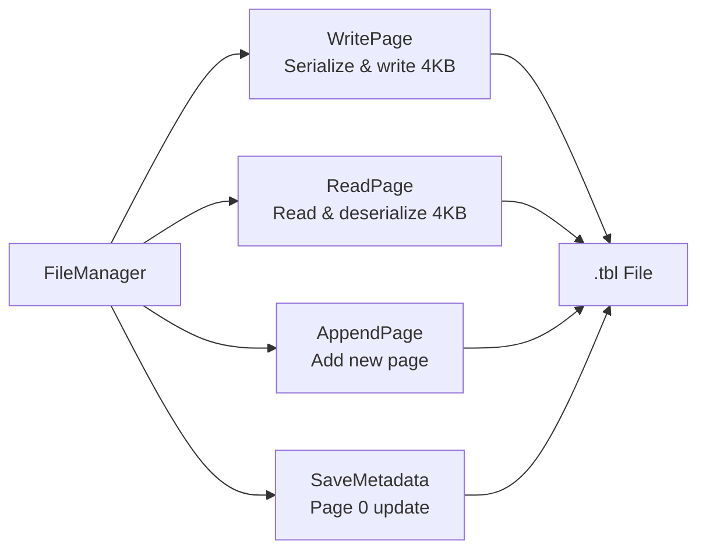

**Page Format**:
```
Page Structure (4KB)
├── Records (MessagePack)
│   ├── Record 1: {id, name, email, ...}
│   ├── Record 2: {id, name, email, ...}
│   └── ...
└── Free space
```

**Key Files**:
- `FileManager.cs` - File operations (225 lines)

---

### Indexing Layer

**Purpose**: Provides fast lookups using hash indexes (O(1)) and range queries using B-tree indexes (O(log n)).

#### Index Architecture

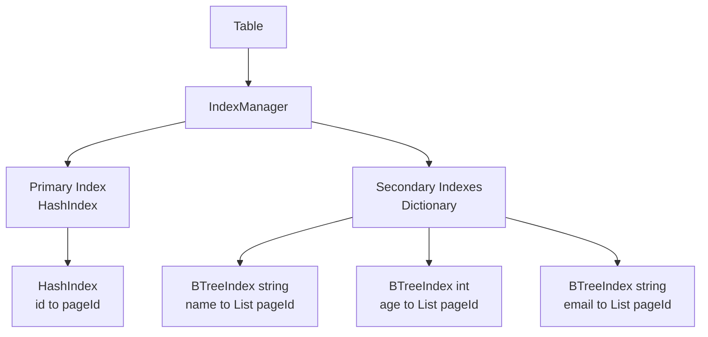

#### HashIndex

O(1) lookup for primary keys.

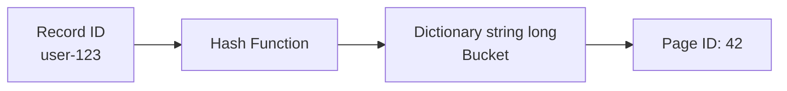

**Implementation**:
```csharp
class HashIndex {
    private Dictionary<string, long> _index;
    
    void Add(string key, long pageId) {
        _index[key] = pageId;
    }
    
    long? Lookup(string key) {
        return _index.TryGetValue(key, out var pageId) 
            ? pageId 
            : null;
    }
}
```

**Persistence**:
- Stored in `.idx` files
- Serialized with MessagePack
- Loaded on table open

#### BTreeIndex

O(log n) range queries for secondary indexes.

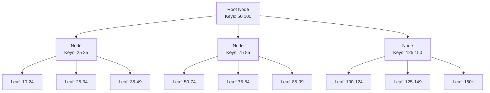

**B-Tree Properties**:
- Order: 4 (max 3 keys per node)
- Self-balancing
- Supports range queries: `>, <, >=, <=, BETWEEN`
- Leaf nodes contain all values

**Operations**:
```csharp
// Insert
BTreeIndex<int> index = new();
index.Insert(25, pageId: 10);

// Point query
var pages = index.Search(25);

// Range query
var pages = index.RangeSearch(20, 30);
```

**Key Files**:
- `IndexManager.cs` - Multi-index coordinator (515 lines)
- `HashIndex.cs` - Primary key index (111 lines)
- `BTreeIndex.cs` - B-tree implementation (799 lines)
- `IndexFile.cs` - Index persistence (171 lines)

#### Index Persistence

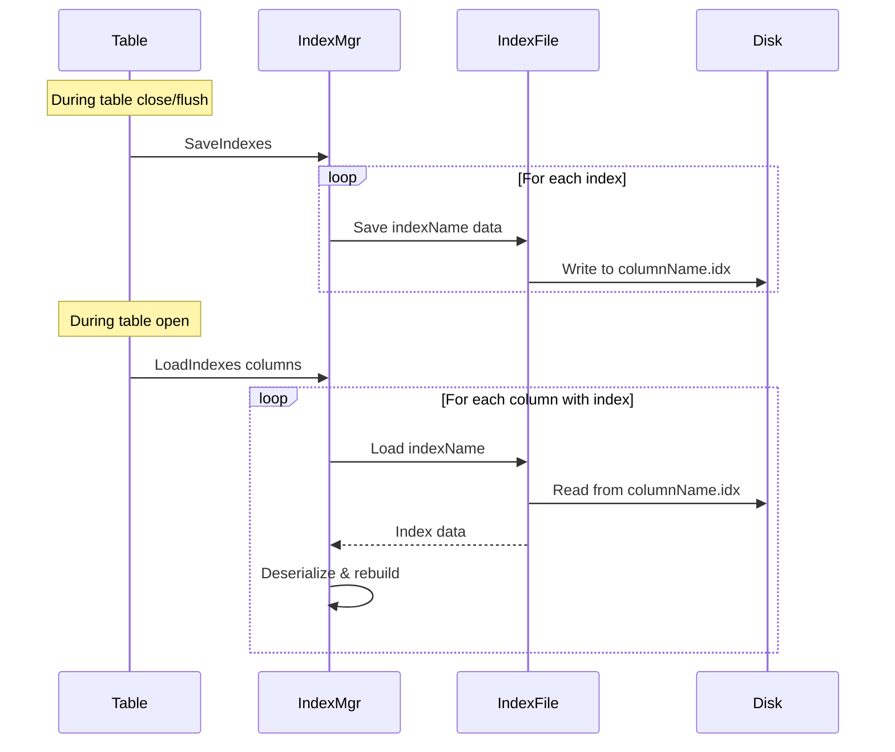

**Index File Format**:
```
Column.idx file
├── Index Type (Hash or BTree<T>)
├── Key Count
└── Serialized Index Data (MessagePack)
    ├── Hash: Dictionary<string, long>
    └── BTree: Serialized tree nodes
```

---

## Data Flow

### Complete Query Flow

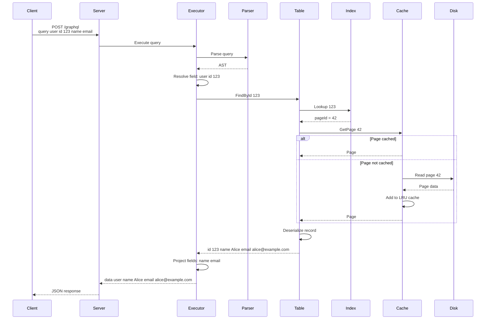

### Schema-Driven Initialization

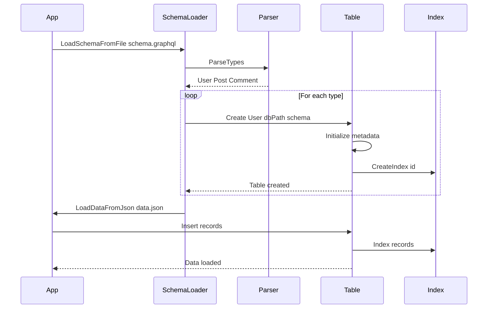

### Relationship Resolution

```mermaid
sequenceDiagram
    participant Executor
    participant BatchLoader
    participant Table
    participant Index
    
    Note over Executor: Query users name posts title
    
    Executor->>Table: SelectAll User
    Table-->>Executor: user1 user2 user3
    
    Executor->>Executor: Need posts for each user
    Executor->>BatchLoader: LoadMany userId1 userId2 userId3
    
    BatchLoader->>Table: SelectAll Post
    Table-->>BatchLoader: All posts
    
    BatchLoader->>BatchLoader: Group by userId
    BatchLoader-->>Executor: userId1 post1 post2<br/>userId2 post3<br/>userId3 empty
    
    Executor->>Executor: Merge users with posts
    Executor-->>Executor: Complete result
```

---

## Key Algorithms

### B-Tree Insert

```
INSERT(key, value):
1. If tree is empty:
   - Create root leaf node
   - Insert key-value
   - Return

2. Find target leaf node:
   - Start at root
   - Navigate down tree comparing key
   - Stop at leaf node

3. Insert into leaf:
   - Add key-value to sorted position
   
4. If leaf is full (> maxKeys):
   - Split leaf at midpoint
   - Create new leaf node
   - Move half keys to new node
   - Promote middle key to parent
   
5. If parent is full:
   - Recursively split parent
   - May create new root (tree grows upward)
```

### LRU Cache Eviction

```
GET_PAGE(pageId):
1. Check if page in cache:
   - If YES:
     * Move page to front of LRU queue
     * Return page (cache hit)
   
   - If NO:
     * Read page from disk
     * If cache is full:
       - Remove least recently used page (tail of queue)
     * Add new page to front of queue
     * Return page (cache miss)
```

### Batch Loading (N+1 Prevention)

```
LOAD_RELATIONSHIPS(parentRecords, relationshipField):
1. Extract all foreign keys from parent records

2. Load related records in single query:
   SELECT * FROM RelatedTable 
   WHERE id IN (foreignKeys)

3. Group related records by foreign key

4. Return map: foreignKey → [related records]

5. Executor merges results with parent records

Result: 1 query instead of N queries
```

---

## Performance Optimizations

### 1. Hash Index for O(1) Primary Key Lookups

```mermaid
graph LR
    Query[FindById user-123]
    Hash[HashIndex]
    Page[Page 42]
    Record[User Record]
    
    Query -->|O1| Hash
    Hash -->|pageId| Page
    Page --> Record
    
```

**Impact**: 
- Before: O(n) linear scan
- After: O(1) hash lookup
- Speedup: 100-1000x for large tables

### 2. B-Tree Indexes for Range Queries

```mermaid
graph TB
    Query[age >= 25 AND age <= 35]
    BTree[BTreeIndex age]
    Results[Matching Records]
    
    Query -->|O log n| BTree
    BTree -->|Range scan| Results
    
```

**Impact**:
- Before: O(n) full table scan
- After: O(log n) tree traversal + range scan
- Speedup: 10-100x for filtered queries

### 3. LRU Page Cache

```mermaid
graph LR
    subgraph "Hot Data (Cached)"
        Page1[Page 1]
        Page2[Page 2]
        Page3[Page 3]
    end
    
    subgraph "Cold Data (Disk)"
        Disk[Other Pages]
    end
    
    Query --> Page1
    Query --> Page2
    Query --> Page3
    
    CacheMiss --> Disk
    
```

**Impact**:
- Cache hit: ~1μs (memory access)
- Cache miss: ~100μs (disk I/O)
- 100x speedup for hot data

### 4. MemTable Write Buffering

```mermaid
graph LR
    Insert1[Insert] -->|Buffer| MemTable
    Insert2[Insert] -->|Buffer| MemTable
    Insert3[Insert] -->|Buffer| MemTable
    
    MemTable -->|Batch flush| Disk[Disk Write]
    
```

**Impact**:
- Reduces disk I/O by 1000x (1 write per 1000 inserts)
- Faster insert throughput
- Sequential disk writes (more efficient)

### 5. Batch Relationship Loading

**Without Batch Loading (N+1 Problem)**:
```
Query: users posts title

SELECT * FROM User           -- 1 query
SELECT * FROM Post WHERE userId = 1   -- 1 query
SELECT * FROM Post WHERE userId = 2   -- 1 query
SELECT * FROM Post WHERE userId = 3   -- 1 query
...
Total: N+1 queries
```

**With Batch Loading**:
```
Query: users posts title

SELECT * FROM User           -- 1 query
SELECT * FROM Post WHERE userId IN 1 2 3...  -- 1 query
Total: 2 queries
```

**Impact**:
- Reduces queries from N+1 to 2
- 10-100x speedup for relationship queries

---

## Deployment Modes

### Embedded Mode

```mermaid
graph LR
    App[Application Code]
    Core[SharpGraph.Core]
    Disk[Local Disk]
    
    App -->|Direct API calls| Core
    Core -->|Read/Write| Disk
    
```

**Use Cases**:
- Desktop applications
- Single-process servers
- Testing and development
- Local data storage

### Server Mode

```mermaid
graph TB
    Client1[Client App 1]
    Client2[Client App 2]
    Client3[Client App 3]
    
    Server[SharpGraph.Server<br/>HTTP Server]
    Core[SharpGraph.Core]
    Disk[Shared Disk]
    
    Client1 -->|HTTP| Server
    Client2 -->|HTTP| Server
    Client3 -->|HTTP| Server
    
    Server --> Core
    Core --> Disk
    
```

**Use Cases**:
- Multi-client access
- Remote applications
- Microservices
- Web APIs

---

## File Structure on Disk

```
project/
├── src/
│   ├── SharpGraph.Core/          # Core database engine
│   │   ├── GraphQL/               # Query parsing & execution
│   │   │   ├── GraphQLLexer.cs
│   │   │   ├── GraphQLParser.cs
│   │   │   ├── GraphQLExecutor.cs
│   │   │   ├── BatchLoader.cs
│   │   │   └── AST.cs
│   │   ├── Storage/               # Storage layer
│   │   │   ├── Table.cs
│   │   │   ├── MemTable.cs
│   │   │   ├── PageCache.cs
│   │   │   ├── FileManager.cs
│   │   │   ├── IndexManager.cs
│   │   │   ├── HashIndex.cs
│   │   │   └── BTreeIndex.cs
│   │   ├── GraphQLSchemaParser.cs
│   │   └── SchemaLoader.cs
│   └── SharpGraph.Server/         # HTTP server
│       └── Program.cs
├── graphql_db/                    # Database directory
│   ├── User.tbl                   # User table file
│   ├── Post.tbl                   # Post table file
│   ├── User_indexes/              # User indexes
│   │   ├── id.idx                 # Primary key index
│   │   ├── email.idx              # Email index
│   │   └── name.idx               # Name index
│   └── Post_indexes/              # Post indexes
│       ├── id.idx
│       └── userId.idx             # Foreign key index
└── schema.graphql                 # GraphQL schema
```

---

## Summary

SharpGraph's architecture is designed for:

1. **Simplicity**: GraphQL-native schema definition, no C# classes needed
2. **Performance**: Multiple optimization layers (indexes, caching, batching)
3. **Flexibility**: Embedded or server deployment modes
4. **Persistence**: Durable page-based storage with crash recovery
5. **Scalability**: LRU caching and efficient indexing for large datasets

The layered design ensures clean separation of concerns while maintaining high performance through strategic optimizations at each layer.
