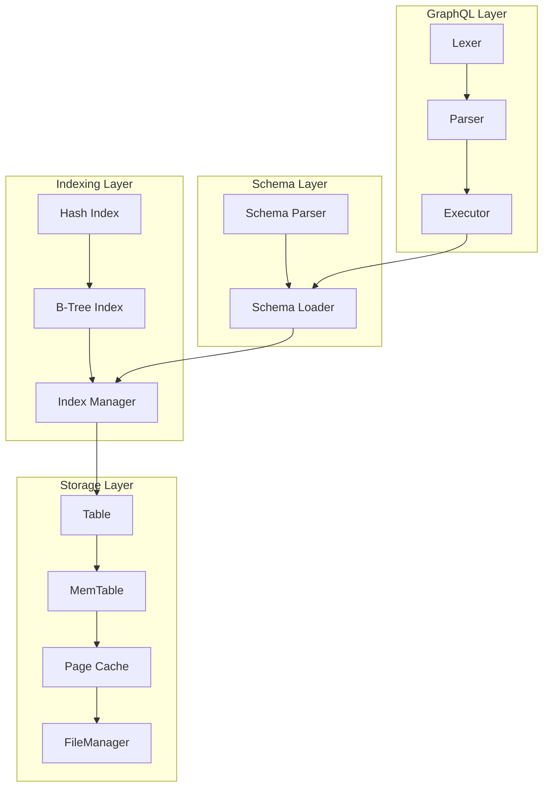

# SharpGraph - GraphQL-Native Database for .NET

> ⚠️ **UNDER HEAVY CONSTRUCTION** ⚠️  
> This project is currently undergoing major development and refactoring. Features, APIs, and documentation may change rapidly. Please check back regularly for updates.

[](https://dotnet.microsoft.com/download/dotnet/9.0) [](https://opensource.org/licenses/MIT) []()

A high-performance, embedded, GraphQL-native database engine written in C# for .NET 9+. Define your database schema in GraphQL SDL, load data from JSON files, and query with native GraphQL - all without writing any C# table definition code.

> ** Prototype Status**: This is an experimental database engine. While it has comprehensive features and passes all tests, it's not yet ready for production use. Use for research, prototyping, and educational purposes.

## Table of Contents

- [Quick Start](#quick-start)
- [Key Features](#key-features)
- [Documentation](#documentation)
- [Architecture](#architecture)
- [SharpGraph IDE](#sharpgraph-ide)
- [Performance](#performance)
- [Examples](#examples)
- [Project Structure](#project-structure)
- [Contributing](#contributing)
- [License](#license)

### Documentation

- [**⚡ Quick Start**](examples/StarWars/quick-start.md) - Get up and running in 5 minutes with Star Wars example
- [Getting Started Guide](docs/getting-started.md) - Installation and quick start tutorials
- [**Filtering & Sorting Guide**](examples/StarWars/filtering-guide.md) - Prisma-style filtering, sorting, pagination with Star Wars examples
- [Features](docs/features.md) - Schema-driven development, GraphQL support, storage engine
- [Configuration](docs/configuration.md) - Database configuration and settings
- [API Reference](docs/api-reference.md) - Complete API documentation
- [Examples](docs/examples.md) - Code examples and tutorials
- [Performance](docs/performance.md) - Benchmarks and optimization guide
- [Indexing](docs/indexing.md) - Index types and performance tuning
- [Storage](docs/storage.md) - Storage engine architecture and internals
- [Relationships](docs/relationships.md) - Working with GraphQL relationships
- [Development](docs/development.md) - Building, testing, contributing
- [Roadmap](docs/roadmap.md) - Current status, planned features, known limitations
- [Troubleshooting](docs/troubleshooting.md) - Common issues and solutions
- [Architecture Overview](ARCHITECTURE.md) - Detailed technical architecture

##  Quick Start

```graphql
# schema.graphql
type User {
  id: ID!
  name: String!
  email: String!
  posts: [Post]
}

type Post {
  id: ID!
  title: String!
  content: String!
  author: User
}
```

```csharp
using SharpGraph.Core;
using SharpGraph.Core.GraphQL;

var dbPath = "my_database";
var executor = new GraphQLExecutor(dbPath);
var loader = new SchemaLoader(dbPath, executor);

// Load schema and data
loader.LoadSchemaFromFile("schema.graphql");
loader.LoadData(File.ReadAllText("data.json"));

// Query with relationships
var result = executor.Execute(@"{
  users {
    name
    posts { title }
  }
}");
```

## Prisma-Style Filtering & Sorting

SharpGraph supports Prisma-style filtering and sorting through Connection types. This provides an intuitive, GraphQL-native way to query and sort data.

### Filtering with `where`

Filter records using field-level conditions:

```graphql
query SearchCharacters {
  characters {
    items(where: {name: {contains: "Luke"}}) {
      id
      name
      characterType
    }
  }
}
```

**Available filter operators:**
- `equals`: Exact match
- `contains`: String contains (case-insensitive)
- `startsWith`: String starts with
- `endsWith`: String ends with
- `gt`: Greater than (for numbers)
- `lt`: Less than (for numbers)
- `gte`: Greater than or equal
- `lte`: Less than or equal

**Combined filters with AND/OR/NOT:**

```graphql
query FindHumans {
  characters {
    items(where: {
      AND: [
        {characterType: {equals: "Human"}}
        {name: {contains: "Solo"}}
      ]
    }) {
      id
      name
      characterType
    }
  }
}
```

### Sorting with `orderBy` (Prisma-style)

Sort by one or multiple fields using Prisma's intuitive syntax:

```graphql
query SortedCharacters {
  characters {
    items(orderBy: [{name: asc}]) {
      id
      name
      characterType
    }
  }
}
```

**Multiple sort fields (applied in order):**

```graphql
query MultiSortCharacters {
  characters {
    items(orderBy: [{characterType: asc}, {name: asc}]) {
      id
      name
      characterType
      height
    }
  }
}
```

### Pagination with `skip` and `take`

Paginate through results:

```graphql
query PaginatedCharacters {
  characters {
    items(skip: 0, take: 10) {
      id
      name
      characterType
    }
  }
}
```

### Combined: Filter, Sort, and Paginate

```graphql
query AdvancedQuery {
  characters {
    items(
      where: {characterType: {equals: "Human"}}
      orderBy: [{name: asc}]
      skip: 0
      take: 5
    ) {
      id
      name
      characterType
      height
      mass
    }
  }
}
```

## Auto-Generated CRUD Mutations

SharpGraph automatically generates Create, Update, and Delete mutations for every entity in your schema. No configuration needed!

### Create Mutation

```graphql
mutation CreateCharacter {
  createCharacter(input: {
    name: "Luke Skywalker"
    characterType: "Human"
    appearsIn: ["NEWHOPE", "EMPIRE", "JEDI"]
    height: 172.72
    mass: 77.0
    hairColor: "Blond"
    skinColor: "Fair"
    eyeColor: "Blue"
    birthYear: "19BBY"
    homePlanetId: "tatooine"
  }) {
    id
    name
    characterType
  }
}
```

### Update Mutation

```graphql
mutation UpdateCharacter {
  updateCharacter(
    id: "luke"
    input: {
      name: "Luke Skywalker (Updated)"
      height: 173.0
    }
  ) {
    id
    name
    height
  }
}
```

### Delete Mutation

```graphql
mutation DeleteCharacter {
  deleteCharacter(id: "luke")
}
```

### Bulk Operations Example

```graphql
mutation CreateMultiple {
  c1: createCharacter(input: {
    name: "Character 1"
    characterType: "Human"
  }) {
    id
    name
  }
  
  c2: createCharacter(input: {
    name: "Character 2"
    characterType: "Droid"
  }) {
    id
    name
  }
}
```

## Complete CRUD Example

```graphql
# Create
mutation {
  createFilm(input: {
    title: "A New Hope"
    episodeId: 4
    openingCrawl: "It is a period of civil war..."
    director: "George Lucas"
    producer: "Gary Kurtz"
    releaseDate: "1977-05-25"
  }) {
    id
    title
  }
}

# Read with Filtering
query {
  films {
    items(where: {title: {contains: "Hope"}}) {
      id
      title
      episodeId
    }
  }
}

# Update
mutation {
  updateFilm(id: "1", input: {
    title: "Star Wars: Episode IV - A New Hope"
  }) {
    id
    title
  }
}

# Delete
mutation {
  deleteFilm(id: "1")
}
```

##  Key Features

- ** Schema-Driven**: Define your database with GraphQL SDL - no C# classes needed
- ** High Performance**: Hash indexes (O(1)), B-tree indexes (O(log n)), LRU page cache
- ** Relationships**: Automatic foreign key resolution with batch loading (N+1 prevention)
- ** Embedded Database**: No separate server process required
- ** Page-Based Storage**: 4KB pages with MessagePack serialization
- ** Full GraphQL Support**: Queries, mutations, introspection, fragments
- ** Zero Boilerplate**: Automatic table creation from schema types

##  Documentation

### Getting Started
- [**Getting Started Guide**](docs/getting-started.md) - Installation and quick start tutorials
- [**SharpGraph IDE**](#sharpgraph-ide) - Web-based administration interface
- [**Examples**](docs/examples.md) - Star Wars, Blog, E-Commerce, and Social Network examples

### Core Concepts
- [**Features**](docs/features.md) - Schema-driven development, GraphQL support, storage engine
- [**Architecture**](ARCHITECTURE.md) - System design, components, and data flow
- [**Storage System**](docs/storage.md) - Page-based storage, MemTable, file format
- [**Indexing**](docs/indexing.md) - Hash indexes, B-tree indexes, performance impact
- [**Relationships**](docs/relationships.md) - Foreign keys, relationship types, query resolution

### Performance & Configuration
- [**Performance**](docs/performance.md) - Benchmarks, tuning, optimization tips
- [**Configuration**](docs/configuration.md) - Database options, server settings, performance tuning

### Reference
- [**API Reference**](docs/api-reference.md) - Complete API documentation
- [**Troubleshooting**](docs/troubleshooting.md) - Common issues and solutions
- [**Development Guide**](docs/development.md) - Building, testing, contributing
- [**Roadmap**](docs/roadmap.md) - Current status, planned features, known limitations

##  Architecture Overview

SharpGraph is built as a layered architecture:



For detailed architecture documentation, see [ARCHITECTURE.md](ARCHITECTURE.md).

##  Performance

| Benchmark | Average Time | Throughput |
|-----------|-------------|------------|
| Single record lookup (Hash Index) | 0.40ms | 2,500 ops/sec |
| Range queries (B-Tree) | 0.15ms | 6,667 ops/sec |
| Relationship queries | 1.86ms | 537 ops/sec |
| Full table scans | 0.74ms | 1,351 ops/sec |

*Test environment: Windows 11, .NET 9.0, Star Wars dataset (8 characters, 3 films, 4 planets)*

See [Performance Guide](docs/performance.md) for detailed benchmarks and tuning options.

##  SharpGraph IDE

SharpGraph includes a comprehensive web-based administration interface built with Blazor and AdminLTE. The IDE provides a modern, intuitive interface for managing your GraphQL database.

### Features

- **Dashboard**: Real-time performance metrics, database statistics, and system status
- **GraphQL Playground**: Interactive query editor with syntax highlighting and auto-completion
- **Table Management**: Browse, search, and edit table data with pagination
- **Schema Viewer**: Visualize and manage GraphQL schema definitions
- **Performance Monitoring**: Query performance metrics, cache statistics, and alerts
- **Data Import/Export**: JSON import and export functionality
- **Index Management**: Create and monitor database indexes

### Quick Start

```bash
# Run the IDE
cd src/SharpGraph.Ide
dotnet run

# Open your browser to
https://localhost:5051
```

### Screenshots

The IDE features a modern AdminLTE-based interface with:
- Responsive sidebar navigation
- Real-time performance dashboards
- Interactive GraphQL query playground
- Comprehensive table and data management

---

##  Installation

```bash
# Clone the repository
git clone https://github.com/your-org/sharpgraph.git
cd sharpgraph

# Build the solution
dotnet build --configuration Release

# Run tests
dotnet test

# Run examples
cd examples/StarWars
dotnet run

# Run the IDE
cd src/SharpGraph.Ide
dotnet run
# Then open https://localhost:5051
```

**Requirements:**
- .NET 9.0 or later
- Windows, macOS, or Linux
- Visual Studio 2022 or VS Code (recommended)

##  Use Cases

- **Prototyping**: Rapid GraphQL API development
- **Embedded Applications**: Desktop apps, local-first software
- **Testing**: Mock GraphQL backends for testing
- **Education**: Learning GraphQL and database internals
- **Research**: Experimenting with database architectures

##  Example: Star Wars Database

```bash
cd examples/StarWars
dotnet run
```

Query example:
```graphql
{
  character(id: "luke") {
    name
    height
    friends {
      name
    }
    homePlanet {
      name
      climate
    }
  }
}
```

See [Examples](docs/examples.md) for more use cases including Blog, E-Commerce, and Social Network schemas.

##  Contributing

Contributions are welcome! Please see [Development Guide](docs/development.md) for:
- Building from source
- Running tests
- Code standards
- Pull request process

##  License

MIT License - see [LICENSE](LICENSE) file for details.

##  Credits

- GraphQL specification from [GraphQL.org](https://graphql.org)
- Star Wars example based on official GraphQL tutorial
- Inspired by modern database architectures (PostgreSQL, SQLite, RocksDB)

---

** SharpGraph - Where GraphQL meets high-performance storage!**

*Built with  for the .NET community*
