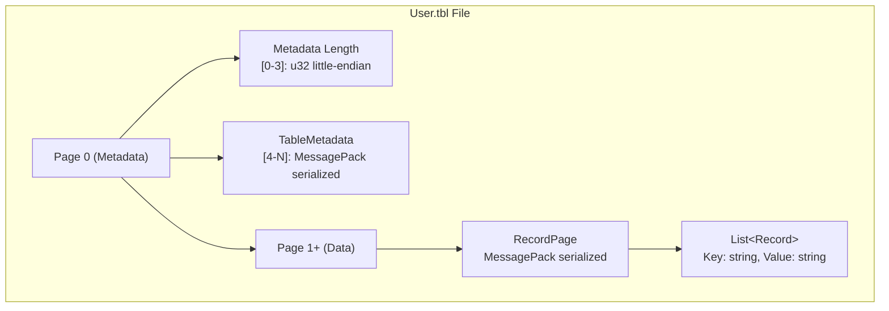
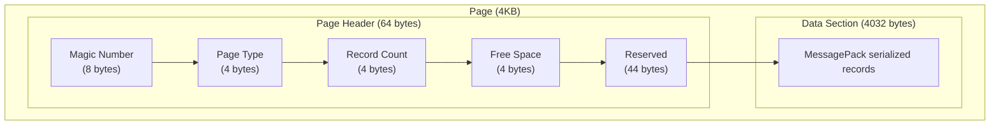

# Storage System

## Page-Based Storage

SharpGraph uses a page-based storage system similar to PostgreSQL and SQLite:

**Page Structure:**
- **Page Size**: 4KB (4096 bytes)
- **Page 0**: Metadata (schema, columns, indexes)
- **Page 1+**: Data pages containing records
- **Format**: MessagePack serialized for compactness

**Benefits:**
- Efficient random access
- Memory-mapped file support
- Atomic page updates
- Platform-agnostic format

## MemTable Write Buffer

**Write-Optimized Buffer:**
- **Capacity**: 16MB default (configurable)
- **Structure**: Sorted dictionary for fast lookups
- **Flushing**: Automatic when capacity exceeded
- **Persistence**: Survives application restarts

```csharp
// Configure MemTable size
var table = Table.Create("User", dbPath);
table.SetMemTableCapacity(32 * 1024 * 1024); // 32MB
```

## File Format

**Compatible Binary Format:**



## Persistence

**Durability Guarantees:**
- Data flushed to disk on disposal
- Page-level atomic writes
- Crash recovery on restart
- Cross-platform compatibility

## Storage Internals

**Page Structure:**



**File Organization:**
- Page 0: Metadata (schema, columns, statistics)
- Page 1+: Data pages with records
- Index files: Separate .idx files for B-tree persistence
